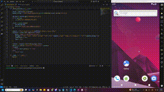

# LATAM Hackathon Demo App

This is a demo application designed for the LATAM Hackathon. The app uses `ADB` to take screenshots from an Android emulator and validates them using **Llama 3.2** for automated testing.

---

## Features

- Capture screenshots directly from an Android emulator via ADB.
- Validate the screenshots using the advanced Llama 3.2 model.
- Automated testing framework using `pytest`.

---

## Prerequisites

Ensure the following are installed and set up:

1. **Python**: Version 3.12 or higher.
2. **ADB (Android Debug Bridge)**: Installed and added to your system's PATH.
3. **SambaNova API Key**: Obtain the key from your SambaNova account.
4. **Python dependencies**: Install via pip:
   ```bash
   pip install -r requirements.txt
   ```

## How to Run

### Step 1: Set Environment Variables

Before running the scripts, set your SambaNova API Key as an environment variable.

```powershell
$env:SAMBANOVA_API_KEY = "your-api-key"
```


```bash
export SAMBANOVA_API_KEY="your-api-key"
```

### Step 2: Run the Application

To capture screenshots and validate them, use one of the following commands:

Option 1: Run the script directly

```bash
python adb_screen.py
```

Option 2: Run the tests using pytest

```bash
pytest test_android_app.py
```

## Project Structure

```
latam_hackathon/
│
├── adb_screen.py          # Script to capture and validate screenshots
├── test_android_app.py    # Pytest test cases for the app
├── requirements.txt       # Python dependencies
└── README.md              # Project documentation
```

## Notes
- Make sure your Android emulator is running and accessible via ADB.
- Test scripts (pytest) require the SambaNova API Key to validate screenshots.

## Demo
